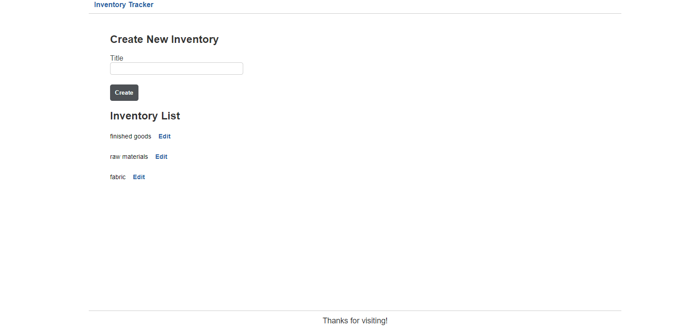
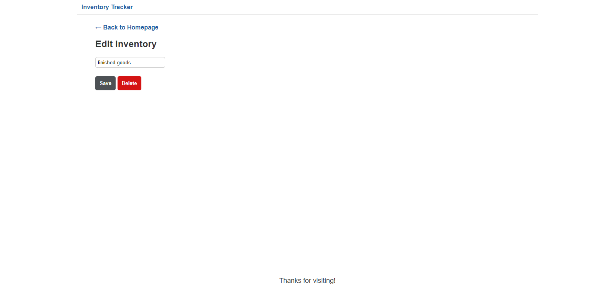

# My-Inventory

Is a web application where users can track Inventory items and being able to create update and delete Inventory.

## Description

This is a sample of an Inventory Tracking System web application , the project uses Object-Relational-Mapping(ORM) to communicate with the database and Model-View-Controller(MVC) that dynamically generate user interface , the database follow the CRUD functionality and hooked using REST API architectural patterns.

## Deployed application

https://glacial-beach-24640.herokuapp.com/

## Table of Contents

* [Installation](#Installation)
* [Usage](#usage)
* [Technologies](#technologies)
* [License](#license)

## Installation

clone this repo  https://github.com/AbeerTannous/My-Inventory

## Usage and Application screen shot

## Technologies

- express
- express-handlebars
- mysql2
- sequelize
- dotenv

## License

MIT License
